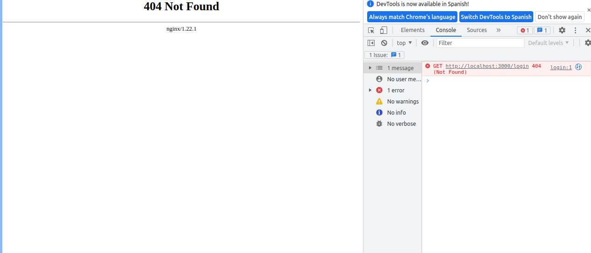
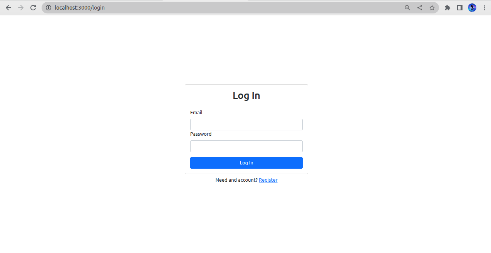

# Actividad 3

## Descripcion del problema
El problema que presentaba era un error 404 Not found el cual se preoduce al recargar la pagina, al entrar direcctamente al localhost:3000 este direcciona a http://localhost:3000/login y carga correctamente, sin embargo al recargar, o dirigirse directamente a la ruta especifica muestra el siguiente error: 



Esto se debe a un error con la configuracion de Nginx ya que no maneja correctamente las ubicaciones de los archivos.

Nginx esta configurado para enrutar solicitudes a la aplicación React solo cuando la URL coincide con la ruta raíz, pero no cuando la URL especifica un archivo específico.

## Solucion 
Para ello se agrego un archivo en la carpeta raiz llamado nginx.conf con el siguiente contenido: 


```
location / {
    try_files $uri $uri/ /index.html;
}
```

Esta directiva dice a Nginx que intente servir el archivo solicitado ($uri) y si no se encuentra, intente servir la ruta raíz ($uri/). Si aún no se encuentra el archivo, finalmente debe servir el archivo index.html, que es el punto de entrada de la aplicación React.

Tambien se realizaron modificaciones en el archivo de nginx.Dockerfile:


Se copia el archivo nginx.conf que contiene la configuracion respectiva:

```
COPY nginx.conf /etc/nginx/conf.d/default.conf
```

Indicando el puerto que tendra el contenedor:
```
EXPOSE 80
```

Y finalmente se usa cmd para ejecutar nginx:
```
CMD ["nginx", "-g", "daemon off;"]
```

De esta manera el frontend estara funcionando de manera correcta: 


